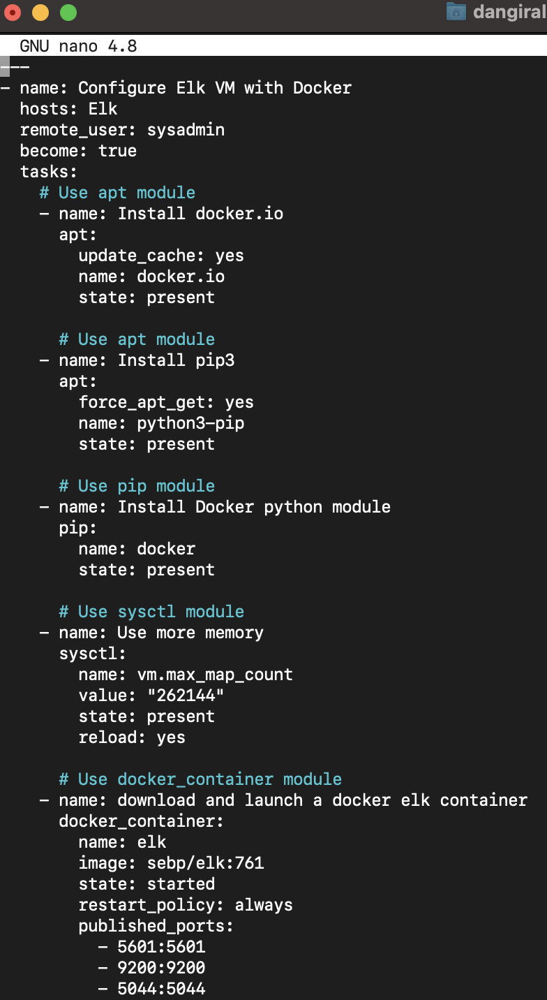
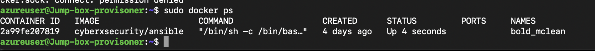

# Elk-Project-1-
ELK Stack project 
## Automated ELK Stack Deployment!
The files in this repository were used to configure the network depicted 
below.

 

These files have been tested and used to generate a live ELK deployment on Azure. They can be used to either recreate the entire deployment pictured above. Alternatively, select portions of the YML file may be used to install only certain pieces of it, such as Filebeat.

_
/etc/ansible/files/elk.yml
	
  

This document contains the following details:
- Description of the Topology
- Access Policies
- ELK Configuration
  - Beats in Use
  - Machines Being Monitored
- How to Use the Ansible Build

### Description of the Topology

The main purpose of this network is to expose a load-balanced and monitored instance of DVWA, the D*mn Vulnerable Web Application.

Load balancing ensures that the application will be highly available, in addition to restricting access to the network.

The load balancer provides resiliency to the network by having the ability to shift network traffic amongst the three servers incase any of the other servers fail. Load balancers provide great defense against Ddos attacks. 

Integrating an ELK server allows users to easily monitor the vulnerable VMs for changes to the data and system logs.

- _TODO: What does Filebeat watch for?

The FileBeat monitors logfiels that we as the users specify. Once the location of the Filebeat is specified, FileBeat begins collects log data like failed sign login attempts.  

- _TODO: What does Metricbeat record?_
 
The Metricbeat records metrics such as disk utilization or CPU usage.

The configuration details of each machine may be found below.

| Name     | Function | IP Address | Operating System |
|----------|----------|------------|------------------|
| Jump Box | Gateway  | 10.0.0.8   | Linux            |
| DVWA-VM1 | Server   | 10.0.0.4   | Linux            |
| DVWA-VM2 | Server   | 10.0.0.5   | Linux            |
| ELKVM    | Server   | 10.1.0.5   | Linux            |

### Access Policies

The machines on the internal network are not exposed to the public Internet. 

Only the Jump-Box machine can accept connections from the Internet. Access to this machine is only allowed from the following IP addresses:

Whitelisted Ip addresses 68.132.51.185.

Machines within the network can only be accessed by SSH.

- _TODO: Which machine did you allow to access your ELK VM? What was its IP address?_
	 
The JumpboxVM is the only machine that can SSH into the ELK VM within the Elkvnet. 

A summary of the access policies in place can be found in the table below.

| Name     | Publicly Accessible| Allowed IP Addresses |
|----------|--------------------|----------------------|
| Jump Box |  Yes               |  68.132.51.185       |
| ElkVM    |  Yes  	            |10.0.0.8/68.132.51.185|
| Web-1    |  No                | 10.0.0.8/10.1.0.5    |
| web-2    | No                 | 10.0.0.8/10.1.0.5    |
| web-3.   | No                 |.10.0.0.8/10.1.0.5    |

### Elk Configuration

Ansible was used to automate configuration of the ELK machine. No configuration was performed manually, which is advantageous because...
- _TODO: What is the main advantage of automating configuration with Ansible?_
 	The main advantages of automating configurations with ansible is that it facilitates the representation of infrastructure code. 

The playbook implements the following tasks:
- _TODO: In 3-5 bullets, explain the steps of the ELK installation play. E.g., install Docker; download image; etc._

- The Elk playbook file installs docker.io onto the elk server
- download and launch docker elk container 
- downloads and starts filebeat to begin harvesting log data and send to the server
- downloads and starts metricbeat to begin collecting metrics data and send to the server.

The following screenshot displays the result of running `docker ps` after successfully configuring the ELK instance.

### Target Machines & Beats
This ELK server is configured to monitor the following machines:
- _TODO: List the IP addresses of the machines you are monitoring_
	
| VM    | Function    | IP Address  |
|-------|-------------|-------------|
| web-1 | Docker-DVWA | 10.0.0.4    |
| web-2 | Docker-DVWA | 10.0.0.5    |
| web-3 | Docker-DVWA | 10.0.0.6    |

	

We have installed the following Beats on these machines:
- _TODO: Specify which Beats you successfully installed_

Filebeat and MetricBeat were installed on  Web-1, Web-2 and Web-3. 

These Beats allow us to collect the following information from each machine:

- TODO: In 1-2 sentences, explain what kind of data each beat collects, and provide 1 example of what you expect to see. E.g., `Winlogbeat` collects Windows logs, which we use to track user logon events, etc._
		
    Filebeat collects log files from specified locations and can help one visualize any changes done within those sepcified file locations. On the otherhand, Metricbeat collects metrics and statistics from ther devices on the server and allows for a more accurate visualization of the data collected for disk utilization or cpu usage.  

### Using the Playbook
In order to use the playbook, you will need to have an Ansible control node already configured. Assuming you have such a control node provisioned: 

SSH into the control node and follow the steps below:- explain what the playbook does 
- Copy the ansible.config file to /etc/ansible within the ansible container.
- Update the ansible.config file to include the IP of the machines.
- Run the playbook, using ansible-playbook elk.yml and navigate to 23.99.192.155:5601/app/kibana to check that the installation worked as expected.

_TODO: Answer the following questions to fill in the blanks:_
- _Which file is the playbook?  Where do you copy it?_ 
- The playbook file is the filebeat-playbok.yml and copy it into the elk.yml file. 
- _Which file do you update to make Ansible run the playbook on a specific machine? How do I specify which machine to install the ELK server on versus which to install Filebeat on?_ Within the hosts file you can specify whihc machine to install the elk server.  
- _Which URL do you navigate to in order to check that the ELK server is running?
      23.99.192.155:5601/app/kibana.However port 9200 and 5400 would work aswell. 

_As a **Bonus**, provide the specific commands the user will need to run to download the playbook, update the files, etc._

Start by downloading the playbook. From the local machine ssh into jumpbox and get inside the Ansible and access your docker using Sudo docker contaienr start (containername) in my case it was bold_mclean. 
Next you want to navigate to /etc/ansible/roles/filebeat.yml
Run this commandd ansible-playbook filebeat.yml
